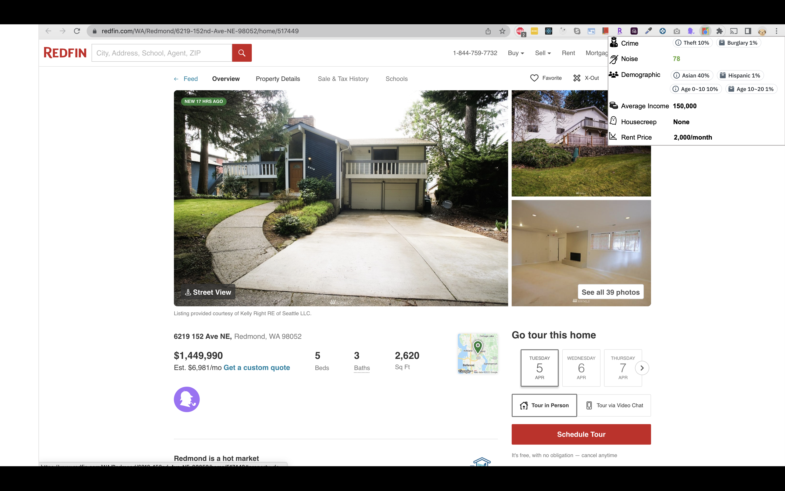

## Table of Contents
- [Table of Contents](#table-of-contents)
- [Mock Up](#mock-up)
- [Data Points to Collect](#data-points-to-collect)
  - [Crime-related data points](#crime-related-data-points)
  - [Noise](#noise)
  - [Demographic](#demographic)
  - [Distance to Powerline](#distance-to-powerline)
  - [Average Income](#average-income)
  - [House Creep](#house-creep)
  - [Rent Price](#rent-price)

## Mock Up


## Data Points to Collect
### Crime-related data points
  
1. Given the latitude and longitude, return the crime score. [(Ref)](https://rapidapi.com/yourmapper/api/crimescore/) 

    Example Request:
    ```bash
    curl --request GET \
        --url 'https://crimescore.p.rapidapi.com/crimescore?lat=38.08809&lon=-85.679626&f=json&id=174' \
        --header 'X-RapidAPI-Host: crimescore.p.rapidapi.com' \
        --header 'X-RapidAPI-Key: 8250e38278msh93c58f0574456f1p168440jsn5404cf0da539'
    ```
    Example 200 Response:
    ```
    Not found
    ```
   
2. Given the latitude, longitude and distance, return the incidence details. [(Ref)](https://rapidapi.com/crimeometer/api/crimeometer/)

    Example Request:
    ```bash
        curl --request GET \
            --url 'https://crimeometer.p.rapidapi.comraw-data/?datetime_end=%3CREQUIRED%3E&lat=%3CREQUIRED%3E&datetime_ini=%3CREQUIRED%3E&lon=%3CREQUIRED%3E&distance=%3CREQUIRED%3E' \
            --header 'X-RapidAPI-Host: crimeometer.p.rapidapi.com' \
            --header 'X-RapidAPI-Key: 8250e38278msh93c58f0574456f1p168440jsn5404cf0da539' \
            --header 'x-api-key: k3RAzKN1Ag14xTPlculT39RZb38LGgsG8n27ZycG'
    ```

    Example 200 Response:
    ```json
    [
    {
        "total_incidents": 2,
        "total_pages": 1,
        "incidents": [
        {
            "city_key": "AUS",
            "incident_code": "20191101137",
            "incident_date": "2019-04-20T15:53:00.000Z",
            "incident_offense": "Driving Under the Influence",
            "incident_offense_code": "90D",
            "incident_offense_description": "Driving Under the Influence",
            "incident_offense_detail_description": "Driving Under the Influence at 5309 E RIVERSIDE DR",
            "incident_offense_crime_against": "Society",
            "incident_offense_action": "C",
            "incident_source_original_type": "DWI",
            "incident_source_name": "Austin_Police_Department_Crime_Reports",
            "incident_latitude": 30.2292141,
            "incident_longitude": -97.71322768,
            "incident_address": "5309 E RIVERSIDE DR"
        },
        {
            "city_key": "AUS",
            "incident_code": "20191101207",
            "incident_date": "2019-04-20T16:54:00.000Z",
            "incident_offense": "Assault Offenses",
            "incident_offense_code": "13A",
            "incident_offense_description": "Aggravated Assault",
            "incident_offense_detail_description": "Aggravated Assault at 5809 SWEENEY CIR",
            "incident_offense_crime_against": "Person",
            "incident_offense_action": "C",
            "incident_source_original_type": "AGG ASSAULT FAM/DATE VIOLENCE",
            "incident_source_name": "Austin_Police_Department_Crime_Reports",
            "incident_latitude": 30.30535921,
            "incident_longitude": -97.67908217,
            "incident_address": "5809 SWEENEY CIR"
        }
        ]
    }
    ]
    ```

Another API that returns similar data is [CrimeData](http`://rapidapi.com/jgentes/api/crime-data/).

Example Request:
```bash
    curl --request GET \`
        --url 'https://jgentes-crime-data-v1.p.rapidapi.com/crime?startdate=9%2F19%2F2015&enddate=9%2F25%2F2015&long=-122.5076392&lat=37.757815' \
        --header 'X-RapidAPI-Host: jgentes-Crime-Data-v1.p.rapidapi.com' \
        --header 'X-RapidAPI-Key: SIGN-UP-FOR-KEY'
```

Example Response:
```json
    [
        {
        "description":"HARASSING COMMUNICATIONS",
        "datetime":"6/24/2014 11:15 PM",
        "location":[42.343060293817736, -83.02064787655652]
        },
        {
            "description":"LARCENY - PERSONAL PROPERTY FROM VEHICLE",
            "datetime":"6/24/2014 08:15 PM",
            "location":[42.33607605681727, -83.05793091956167]
        }
    ]
```

### Noise
### Demographic
### Distance to Powerline
### Average Income
### House Creep
### Rent Price